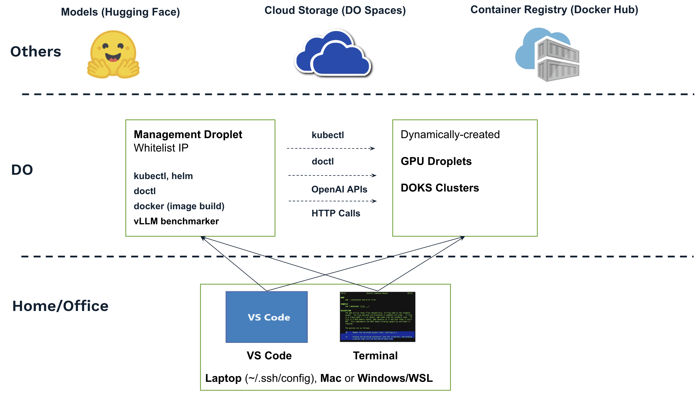

# Environment Setup

We need an environment preconfigured with commonly used tools for testing, such as Python, doctl, helm, kubectl, Docker Engine, and vLLM benchmarker, etc. We can provision a management droplet for this purporse or use your laptop.

You can skip the management droplet if you prefer to install and run these tools on your Windows/WSL or Mac system. However, doing so may impact your laptop, and you will also need to manage potential compatibility issues—for example, a Docker image built on Mac may not run directly on Linux.



## Provision a Managment Droplet

Provision a management droplet using the DO Console:

```
Region: Atlanta - ATL1
VPC: default-atl1
Image: Ubuntu 24.04
Type: Basic -> Premium Intel, $32/mo
SSH Key: <YOUR_PUBLIC_KEY>
HOSTNAME: <YOUR_HOST_NAME>
```

Visit [this website](https://whatismyipaddress.com/) to find your public IP address, then whitelist this IP address for access to the management droplet:

```
DO Console -> Networking -> Firewalls -> Create:

Inbound Rules:
ICMP    - Sources: All IPv4 & IPv6
All TCP - Sources: <YOUR_HOME_IP>
All UDP - Sources: <YOUR_HOME_IP>

Outbound Rules:
ICMP    - Destinations: All IPv4 & IPv6
All TCP - Destinations: All IPv4 & IPv6
All UDP - Destinations: All IPv4 & IPv6

Apply to the management droplet.
```

## Setup Your Laptop

Open your SSH configuration file on your laptop (Mac in this example) and append the wildcard entry at the end.

```
nano ~/.ssh/config

# Others for specific match
Host dos0
  HostName dos0
  User ubuntu
  IdentityFile ~/.ssh/rx202412

...
...
...

# Wildcard entry for all droplets, including the management droplet and any dynamically created droplets.
Host * 
  User root
  IdentityFile ~/.ssh/<YOUR_PRIVATE_KEY_NAME>
```

Install VS Code on your laptop and use it to access the management droplet:

- In VS Code, click the bottom-left corner and select “Connect to Host,” then add the droplet’s IP address.
- Open a terminal in the VS Code and create a folder, such as /root/test.
- Open the folder.
- Install the Python extension (optional).

## Install Tools on the Managment Droplet

[Install and configure doctl](https://docs.digitalocean.com/reference/doctl/how-to/install/) on the management droplet:

```
apt update 
apt install net-tools tree iproute2 -y

sudo snap install doctl
mkdir -p /root/.config

# Need to create a Personal Access Token first: the DO Consle -> API -> Token
doctl auth init

# Find your ssh-key ID
doctl compute ssh-key list

# List all droplet slugs
doctl compute size list 

# List droplet images
doctl compute image list | grep AMD
doctl compute image list | grep NVIDIA

# List all VPC IDs
doctl vpcs list
```

[Install kubectl](https://kubernetes.io/docs/tasks/tools/install-kubectl-linux/) on the management droplet to match the latest DOKS (1.34.1):

```
curl -LO https://dl.k8s.io/release/v1.34.1/bin/linux/amd64/kubectl
chmod +x kubectl
mv kubectl /usr/local/bin/

mkdir -p /root/.kube

# Allow doctl to access /root/.kube/config, the kube-config is the interface name
snap connect doctl:kube-config 
```

Install Python libaries:

```
apt install python3-pip
pip install python-dotenv  --break-system-packages
```

## Create a Hugging Face Account

Create a Hugging Face account and accept the agreement for the popular models:

```
https://huggingface.co/meta-llama/Llama-3.1-8B-Instruct
https://huggingface.co/meta-llama/Llama-3.1-70B-Instruct
https://huggingface.co/meta-llama/Llama-3.2-1B-Instruct
```

Generate a token with READ permission (not Fine-grained or Write), which will be used to download these models during testing.
